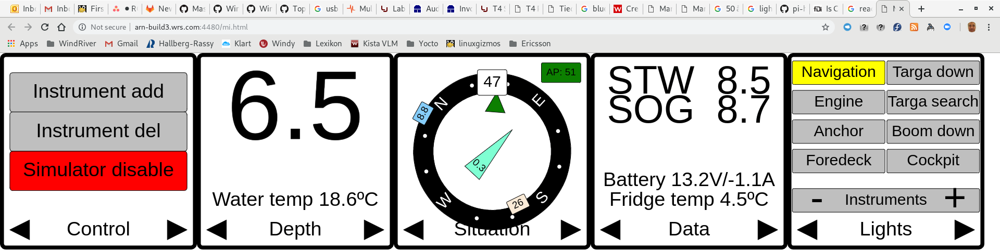
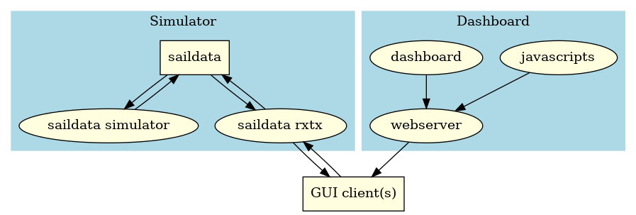

# Example platform setup for building GUI with wrlinux



This repository showcases creation of remote GUI for wrlinux devices, as the example above.
The basic mechanism used is client(s) connected via network (wifi, wired, ...) that
could be laptop, tablet, mobile or so and browsing to the target.
At least for linux, same design could easily be reused for local gui by mere adding
of a web renderer (webkit) into the platform and starting a local browser on boot.
In addition to the webpage(s), some communication channel to/from browser/device is
needed and here we use websocket and protobuf to implement this.

The overall design with wrlinux/overc is based on two containers

* a dashboard containing GUI server (via lighttpd, html5 files, javascripts, websocket, protobuf etc)
* sensordata that feeds the GUI client with new data (named simulator as it is simulated sensor data)
  as well is receiving data from the GUI client.



With this scheme, it gets very flexible to implement a complete system.
The different parts (sensordata, dashboard and client) could all run on same box,
for a standalone system, or they could be split between a server
(running sensordata/dashboard) and a client (smart display, tablet, mobile,
laptop ...) that connects to it.
With the latter approach and also having the server as a cluster, we could make
interesting redundant high availability systems via cheap off-the-shelf SBC's.
The different parts can also be developed with different teams and/or release cycles
if needed, as the interface is neatly contained in a protobuf scheme.
Also easily tailored for different variants of same box but with differentiated
GUI "skins", by merely swapping the dashboard container.

By basing the GUI on HTML5, javascripts and such, we enable it to be implemented
via easily found contractors and/or own resources as it is quite the hype of modern
GUI standards (at least as of 2020 when this was written :) ) and also enables
the GUI to be local on device and/or remotely accessed.

It could also be simplified by skipping container technology and having it all
in the base platform image but it is a less flexible setup.

## configuring
* update location of where a wrlinux mirror is installed in your host
  usually means making a hostconfig-<hostname>.mk file that sets WRL

```bash
[phallsma@arn-phallsma-l4 device-remote-gui]$ cat hostconfig-arn-build3.mk 
WRL := /wr/installs/wrl-19-mirror
[phallsma@arn-phallsma-l4 device-remote-gui]$
```

* update location of where you want your download/sstate cache
  usually means making a hostconfig-<hostname>.mk file, or possibly a
  userconfig-<username>.mk file, that sets 

```bash
[phallsma@arn-phallsma-l4 device-remote-gui]$ cat userconfig-phallsma.mk 
DOWNLOADS_CACHE     := /opt/phallsma/yocto/downloads
SSTATE_MIRROR       := /opt/phallsma/yocto/sstate-mirror
[phallsma@arn-phallsma-l4 device-remote-gui]$
```

## building
The Makefile is setup to build CONTAINERS and IMAGES for MACHINES when running
```bash
[phallsma@arn-phallsma-l4 device-remote-gui]$ make
...
[phallsma@arn-phallsma-l4 device-remote-gui]$
```
MACHINES is a list of MACHINE defines and CONTAINERS/IMAGES is a list of
recipes that is defined in layers. Here we have a simple example of some
marine electronic devices made in a layer
https://gitlab.com/saxofon/meta-marine-instruments.git
That have these containers :

```bash
[phallsma@arn-phallsma-l4 device-remote-gui]$ cat build/layers/meta-marine-instruments/recipes-base/images/oci-dashboard.bb 
SUMMARY = "Application container for mi-dashboard"
DESCRIPTION = "An application container which will run mi-dashboard"

inherit wr-app-container

IMAGE_INSTALL += "mi-dashboard"
[phallsma@arn-phallsma-l4 device-remote-gui]$ cat build/layers/meta-marine-instruments/recipes-base/images/oci-simulator.bb 
SUMMARY = "Application container for mi-simulator"
DESCRIPTION = "An application container which will run mi-simulator"

inherit wr-app-container

IMAGE_INSTALL += "mi-simulator"
[phallsma@arn-phallsma-l4 device-remote-gui]$ 
```

If you only want to build containers and not the overc components :
```bash
[phallsma@arn-phallsma-l4 device-remote-gui]$ make containers
...
[phallsma@arn-phallsma-l4 device-remote-gui]$
```

When build is done, we get these container tarballs :
```bash
[phallsma@arn-phallsma-l4 device-remote-gui]$ ls -lh build/build/tmp/deploy/images/genericx86-64/oci-*bz2
-rw-r--r--. 2 phallsma phallsma 8.6M Jan 20 22:40 build/build/tmp/deploy/images/genericx86-64/oci-dashboard-genericx86-64-20200120205214.rootfs.tar.bz2
lrwxrwxrwx. 2 phallsma phallsma   57 Jan 20 22:40 build/build/tmp/deploy/images/genericx86-64/oci-dashboard-genericx86-64.tar.bz2 -> oci-dashboard-genericx86-64-20200120205214.rootfs.tar.bz2
-rw-r--r--. 2 phallsma phallsma 4.9M Jan 20 22:40 build/build/tmp/deploy/images/genericx86-64/oci-simulator-genericx86-64-20200120205214.rootfs.tar.bz2
lrwxrwxrwx. 2 phallsma phallsma   57 Jan 20 22:40 build/build/tmp/deploy/images/genericx86-64/oci-simulator-genericx86-64.tar.bz2 -> oci-simulator-genericx86-64-20200120205214.rootfs.tar.bz2
[phallsma@arn-phallsma-l4 device-remote-gui]$ 
```
that we can deploy via docker, podman, kubernetes etc.

Together with the overc components we can also continue building a full target image
which already contains the container images as well (and autostarted at boot!).
Please follow [OVERC readme](OVERC.md) for that.

## Running

We can easily run this example via podman, thats import/run/stop/clean like :

### import example container images to storage
```bash
[phallsma@arn-phallsma-l4 device-remote-gui]$ make example-import-images 
podman import -c 'ENTRYPOINT ["/usr/sbin/lighttpd", "-f", "/etc/lighttpd.conf", "-D"]' /home/phallsma/SW/device-remote-gui/build/build/tmp/deploy/images/genericx86-64/oci-dashboard-genericx86-64.tar.bz2 wrl-mi/dashboard
Getting image source signatures
Copying blob fef0cb7bcfaa done  
Copying config d6f347dc91 done  
Writing manifest to image destination
Storing signatures
d6f347dc91973cc981c5d807813c88cc54a2b08acbe4fda89d638fa01f8fb0d9
podman import -c 'ENTRYPOINT ["/usr/bin/mi-simulator"]' /home/phallsma/SW/device-remote-gui/build/build/tmp/deploy/images/genericx86-64/oci-simulator-genericx86-64.tar.bz2 wrl-mi/simulator
Getting image source signatures
Copying blob b10d0fd28241 done  
Copying config 5db4ddf997 done  
Writing manifest to image destination
Storing signatures
5db4ddf9970c659020a30f993359be5c528f8d5c49a2db8acd6b6bed968ee7f8
[phallsma@arn-phallsma-l4 device-remote-gui]$ 
```

### start example containers
```bash
[phallsma@arn-phallsma-l4 device-remote-gui]$ make example-start 
podman container run --rm -d -i -t -p 4444:4444 --name=simulator docker.io/wrl-mi/simulator
b60af2780036b3a53aa3b935e9a53e068bece940c0e1abd210d774261bc6d0bf
podman container run --rm -d -i -t -p 4480:80 --name=dashboard docker.io/wrl-mi/dashboard
6119aeafd3cffb4cef12a69266294512a0c4fa0600b0dfac28d3cf825480203f
Browse to http://arn-phallsma-l4.corp.ad.wrs.com:4480/mi.html
[phallsma@arn-phallsma-l4 device-remote-gui]$ 
```
We can now browse to the host at port 4480 and get a view like 


As this is just an example, we take some shortcuts...
First press the "Simulator enable" button on the left control pad.
This sets the protobuf variable "simulator" to on, which will generate some
wind etc for our demo.
We can now activate the autopilot (button with "AP:" in middle) and set a course
with the inner compass marker. Also pressing different lights on/off via the right pad.

### stop example containers

```bash
[phallsma@arn-phallsma-l4 device-remote-gui]$ make example-stop 
podman stop dashboard
6119aeafd3cffb4cef12a69266294512a0c4fa0600b0dfac28d3cf825480203f
podman stop simulator
b60af2780036b3a53aa3b935e9a53e068bece940c0e1abd210d774261bc6d0bf
[phallsma@arn-phallsma-l4 device-remote-gui]$ 
```

### remove example container images from storage

```bash
[phallsma@arn-phallsma-l4 device-remote-gui]$ make example-delete-images 
podman image rm wrl-mi/dashboard
Untagged: docker.io/wrl-mi/dashboard:latest
Deleted: d6f347dc91973cc981c5d807813c88cc54a2b08acbe4fda89d638fa01f8fb0d9
podman image rm wrl-mi/simulator
Untagged: docker.io/wrl-mi/simulator:latest
Deleted: 5db4ddf9970c659020a30f993359be5c528f8d5c49a2db8acd6b6bed968ee7f8
[phallsma@arn-phallsma-l4 device-remote-gui]$ 
```

## Misc

As well as showing a possible way to implement a GUI for wrlinux, this repo also shows

* a neat project setup when using wrlinux (the top Makefile, host/user configs plus lib.mk/*) that
  enables a platform to be built from scratch automatically, on different hosts. Developers, nightly builds etc
  all use same repo and essentially a single git clone + make would be enough.

* howto easily build application containers with wrlinux.


## Legal notices

### Copyright
All files in this repository is copyright Wind River Systems, Inc.

### Licenses
All files in this repository is BSD-3-Clause licensed unless otherwised stated.

### Attribution
This example platform makes use of :

* WRLinux LTS 19 from Windriver
https://www.windriver.com/products/linux

* meta-javascripts - https://gitlab.com/saxofon/meta-javascripts
  Collection of javascripts for use in embedded linux projects built via yocto.
  This platform then uses these recipes in that layer :
  * closure - https://github.com/google/closure-library
    Google's common JavaScript library.

  * protobuf - https://github.com/google/protobuf
    Protocol Buffers - Google's data interchange format.

  * two.js - https://github.com/jonobr1/two.js
    A renderer agnostic two-dimensional drawing api for the web.

* meta-marine-instruments - https://gitlab.com/saxofon/meta-marine-instruments
  Collection of marine software for use in embedded linux projects built via yocto.
  This platform uses this as an example of GUI component implementation.
