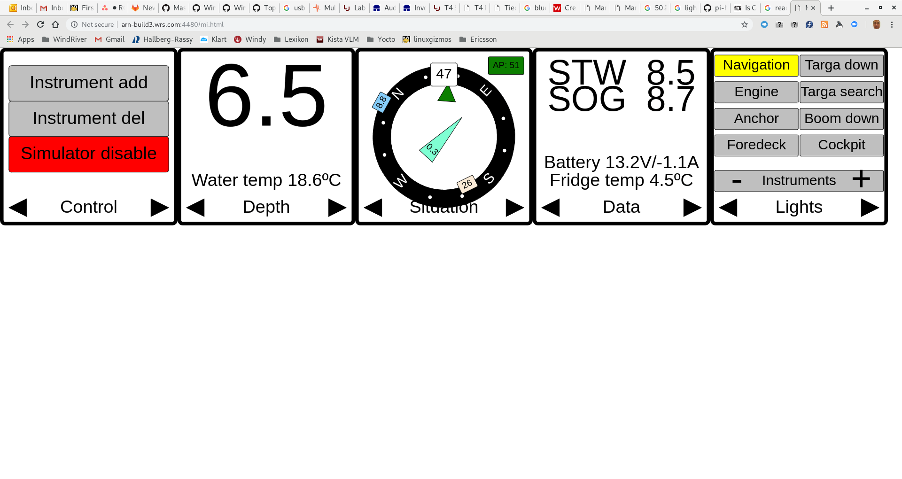

# Example platform setup for building containers with wrlinux

This example builds two containers
* a dashboard containing GUI (via webserver, html5, javascripts, websockets, protobuf etc)
* sensordata that feeds the dashboard (named simulator as it is simulated sensor data) with data updates

## configuring
* update location of where a wrlinux mirror is installed in your host
  usually means making a hostconfig-<hostname>.mk file that sets WRL

```
[phallsma@arn-build3 wrl-containers]$ cat hostconfig-arn-build3.mk 
WRL := /wr/installs/wrl-18-mirror
[phallsma@arn-build3 wrl-containers]$
```

* update location of where you want your download/sstate cache
  usually means making a hostconfig-<hostname>.mk file, or possibly a
  userconfig-<username>.mk file, that sets 

```
[phallsma@arn-build3 wrl-containers]$ cat userconfig-phallsma.mk 
DOWNLOADS_CACHE     := /opt/phallsma/yocto/downloads
SSTATE_MIRROR       := /opt/phallsma/yocto/sstate-mirror
[phallsma@arn-build3 wrl-containers]$ 
```

## building
The Makefile is setup to build CONTAINERS for MACHINES when running
```
[phallsma@arn-build3 wrl-containers]$ make containers
[phallsma@arn-build3 wrl-containers]$ 
```
MACHINES is a list of MACHINE defines and CONTAINERS is a list of container
recipes that is defined in layers. Here we have a simple example of some
marine electronic devices made in a layer
https://gitlab.com/saxofon/meta-marine-instruments.git
That have these containers :

```
[phallsma@arn-build3 wrl-containers]$ cat build/layers/meta-marine-instruments/recipes-base/images/oci-dashboard.bb 
SUMMARY = "An application container for marine instruments webserver"
DESCRIPTION = "An application container for marine instruments webserver"
HOMEPAGE = "https://gitlab.com/saxofon/meta-marine-instruments.git"

TARGETNAME = "container-${PN}"

NO_RECOMMENDATIONS = "1"
IMAGE_LINGUAS = ""

require wr-app-container.inc

IMAGE_INSTALL += "mi-dashboard"
[phallsma@arn-build3 wrl-containers]$ cat build/layers/meta-marine-instruments/recipes-base/images/wr-app-container-mi-simulator.bb 
SUMMARY = "An application container for marine instruments webserver"
DESCRIPTION = "An application container for marine instruments webserver"
HOMEPAGE = "https://gitlab.com/saxofon/meta-marine-instruments.git"

TARGETNAME = "container-${PN}"

NO_RECOMMENDATIONS = "1"
IMAGE_LINGUAS = ""

require wr-app-container.inc

IMAGE_INSTALL += "mi-simulator"
[phallsma@arn-build3 wrl-containers]$ 
```

When build is done, we get these container tarballs :
```
[phallsma@arn-build3 wrl-containers]$ ls build/build/tmp-glibc/deploy/images/qemux86-64/wr-app-container-mi-*bz2
build/build/tmp-glibc/deploy/images/qemux86-64/oci-mi-simulator-qemux86-64.tar.bz2
build/build/tmp-glibc/deploy/images/qemux86-64/oci-dashboard-qemux86-64.tar.bz2
[phallsma@arn-build3 wrl-containers]$ 
```

## Running

There is an example implemented via docker, thats import/run/stop/clean like :

### import example images to docker storage
```
[phallsma@arn-build3 wrl-containers]$ make example-import-images 
cat /opt/phallsma/wrl-containers/build/build/tmp-glibc/deploy/images/qemux86-64/wr-app-container-mi-dashboard-qemux86-64.tar.bz2 | docker import -c 'ENTRYPOINT ["/usr/sbin/lighttpd", "-f", "/etc/lighttpd.conf", "-D"]' - wrl-mi/dashboard
sha256:c7235d6278a2c171bcb215f79f73180ccc39d2063fabea716bce70c7ca822038
cat /opt/phallsma/wrl-containers/build/build/tmp-glibc/deploy/images/qemux86-64/wr-app-container-mi-simulator-qemux86-64.tar.bz2 | docker import -c 'ENTRYPOINT ["/usr/bin/mi-simulator"]' - wrl-mi/simulator
sha256:e144e3b5b89fec9cf2246306e2dd68ae026f30de52f2505f653525a259b83d14
[phallsma@arn-build3 wrl-containers]$ 
```

### start example
```
[phallsma@arn-build3 wrl-containers]$ make example-start
make[1]: Entering directory '/opt/phallsma/wrl-containers'
docker-compose -f examples/docker-compose.yml up -d
Creating network "examples_default" with the default driver
Creating wrl-mis
Creating wrl-miw
Browse to http://arn-build3.wrs.com:4480/mi.html
make[1]: Leaving directory '/opt/phallsma/wrl-containers'
[phallsma@arn-build3 wrl-containers]$ 
```
We can now browse to the host at port 4480 and get a view like 




### stop example

```
[phallsma@arn-build3 wrl-containers]$ make example-stop
docker-compose -f examples/docker-compose.yml down
Stopping wrl-miw ... done
Stopping wrl-mis ... done
Removing wrl-miw ... done
Removing wrl-mis ... done
Removing network examples_default
[phallsma@arn-build3 wrl-containers]$ 
```

### remove example images from docker storage

```
[phallsma@arn-build3 wrl-containers]$ make example-delete-images 
docker rmi wrl-mi/website
Untagged: wrl-mi/website:latest
Deleted: sha256:07e6ea055e317edc04dceb16ff32e9feee8baafc0ccf2d7f9d72eda024e623c0
Deleted: sha256:378a528ec5a8162706eec06141abc3c4c7a93ef5d0ff21b2432281d01a501346
docker rmi wrl-mi/simulator
Untagged: wrl-mi/simulator:latest
Deleted: sha256:b9c037bbc512ccdfd5c711571cf1bd90b7307e975f3d2071a6207bd82a324f61
Deleted: sha256:169d3ce84b32c8a067e42deede17f0ed6ffca5b57c67b8f9d533bf451a7208ec
[phallsma@arn-build3 wrl-containers]$ 
```
